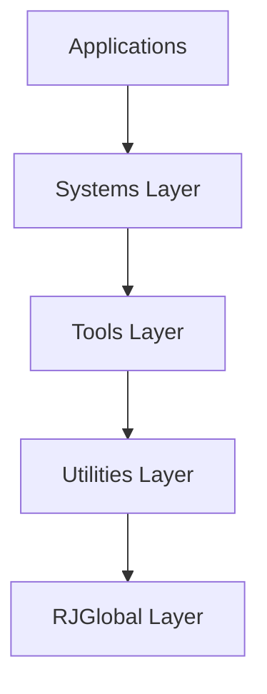

# Code-Romeo Project Analysis & Recommendations

**Analysis Date:** December 11, 2025  
**Project:** Code-Romeo - Cross-platform C rendering framework  
**Repository:** https://github.com/omerfuyar/Code-Romeo

---

## Executive Summary

This document provides a comprehensive analysis of the Code-Romeo project, identifying issues across multiple categories: build system, documentation, security, code quality, testing, and project infrastructure. Each issue is accompanied by specific, actionable solutions.

**Overall Assessment:**
- **Codebase Size:** ~5,800 lines of C code
- **Architecture:** Well-structured layered design (RJGlobal → Utilities → Tools → Systems)
- **Documentation:** Good inline documentation, but missing high-level guides
- **Testing:** Minimal test infrastructure
- **Build System:** Issues with submodule initialization and build script compatibility
- **Security:** Generally good practices, minimal unsafe functions

---

## Table of Contents

1. [Critical Issues](#1-critical-issues)
2. [Build System Issues](#2-build-system-issues)
3. [Documentation Gaps](#3-documentation-gaps)
4. [Security Concerns](#4-security-concerns)
5. [Code Quality Issues](#5-code-quality-issues)
6. [Testing Infrastructure](#6-testing-infrastructure)
7. [Project Infrastructure](#7-project-infrastructure)
8. [Platform-Specific Issues](#8-platform-specific-issues)
9. [Dependency Management](#9-dependency-management)
10. [Development Workflow](#10-development-workflow)

---

## 1. Critical Issues

### 1.1 Submodules Not Initialized by Default

**Problem:**
- The repository requires `--recurse-submodules` during clone, but this is easy to miss
- Build fails immediately if submodules aren't initialized
- Error messages aren't helpful for new users

**Impact:** High - Prevents anyone from building the project on first clone

**Solution:**
1. Add a `.gitmodules` validation in the build script:
```c
// In shuild.c, before SHUILD_IMPLEMENTATION
#include <sys/stat.h>
static bool check_submodules() {
    struct stat st;
    if (stat("dependencies/shuild/shuild.h", &st) != 0) {
        fprintf(stderr, "ERROR: Submodules not initialized!\n");
        fprintf(stderr, "Please run: git submodule update --init --recursive\n");
        return false;
    }
    return true;
}
```

2. Add a build script wrapper that checks and initializes submodules automatically
3. Update README.md with clearer instructions and troubleshooting section

### 1.2 Build Script Has Compilation Errors

**Problem:**
- The shuild dependency has syntax errors preventing compilation
- Incompatibility with current clang/gcc versions
- Missing header includes (dirent.h, etc.)

**Impact:** High - Project cannot be built at all

**Solution:**
1. Test with the latest version of shuild
2. Add version pinning to submodules
3. Create a wrapper build script that validates dependencies before compilation
4. Add fallback Makefile for systems where shuild doesn't compile

### 1.3 No Executable Path Detection on macOS

**Problem:**
- RJGlobal.c line 9 uses `/proc/self/exe` for Unix-like systems
- This doesn't exist on macOS (needs `_NSGetExecutablePath`)
- Author admits not testing on macOS

**Impact:** Medium-High - Project won't work on macOS

**Solution:**
```c
// In RJGlobal.c
#if RJGLOBAL_PLATFORM == RJGLOBAL_PLATFORM_WINDOWS
#include <windows.h>
#define RJGlobal_GetExePath(buffer, bufferSize) GetModuleFileName(NULL, buffer, bufferSize)

#elif RJGLOBAL_PLATFORM == RJGLOBAL_PLATFORM_LINUX
#include <unistd.h>
#define RJGlobal_GetExePath(buffer, bufferSize) readlink("/proc/self/exe", buffer, bufferSize)

#elif RJGLOBAL_PLATFORM == RJGLOBAL_PLATFORM_MACOS
#include <mach-o/dyld.h>
static ssize_t macos_get_exe_path(char *buffer, size_t bufferSize) {
    uint32_t size = (uint32_t)bufferSize;
    if (_NSGetExecutablePath(buffer, &size) == 0) {
        return (ssize_t)strlen(buffer);
    }
    return -1;
}
#define RJGlobal_GetExePath(buffer, bufferSize) macos_get_exe_path(buffer, bufferSize)

#endif
```

---

## 2. Build System Issues

### 2.1 No Standard Build System Alternative

**Problem:**
- Only build option is a custom build library (shuild)
- No CMake, Make, or other standard build tools
- Difficult for contributors to integrate into their workflows

**Impact:** Medium - Limits accessibility for contributors

**Solution:**
1. Add CMakeLists.txt for cross-platform building:
```cmake
cmake_minimum_required(VERSION 3.15)
project(CodeRomeo C)

# Add options for debug/release
option(BUILD_TESTS "Build tests" ON)
option(ENABLE_ASAN "Enable AddressSanitizer" OFF)
option(ENABLE_UBSAN "Enable UndefinedBehaviorSanitizer" OFF)

# Include submodules
add_subdirectory(dependencies/cglm)
add_subdirectory(dependencies/glfw)

# Main library
file(GLOB_RECURSE SOURCES "src/**/*.c" "src/*.c")
add_library(CodeRomeo STATIC ${SOURCES})

target_include_directories(CodeRomeo PUBLIC
    include/
    dependencies/
    dependencies/cglm/include/
    dependencies/glad/include/
    dependencies/glfw/include/
)

# Sanitizers
if(ENABLE_ASAN)
    target_compile_options(CodeRomeo PRIVATE -fsanitize=address)
    target_link_options(CodeRomeo PRIVATE -fsanitize=address)
endif()

if(ENABLE_UBSAN)
    target_compile_options(CodeRomeo PRIVATE -fsanitize=undefined)
    target_link_options(CodeRomeo PRIVATE -fsanitize=undefined)
endif()
```

2. Add simple Makefile as fallback
3. Keep shuild as primary but document alternatives

### 2.2 Inconsistent Compiler Flag Handling

**Problem:**
- Different flags for different compilers scattered throughout build script
- No centralized configuration
- Hard to maintain and extend

**Impact:** Low-Medium - Makes adding new compiler support difficult

**Solution:**
- Create a compiler configuration file (compiler_flags.h or JSON)
- Centralize all compiler-specific logic in one place
- Use feature detection instead of compiler detection where possible

### 2.3 No Build Verification

**Problem:**
- No automated testing after build
- No way to verify build succeeded beyond compilation
- Missing sanity checks

**Impact:** Medium - Can ship broken builds

**Solution:**
1. Add post-build verification:
   - Check that all expected library files exist
   - Verify symbol exports
   - Run basic smoke tests
2. Add to build script:
```c
// After compilation
if (!verify_build_artifacts(arcOutputDirectory)) {
    SHU_LogError(1, "Build verification failed!");
}
```

---

## 3. Documentation Gaps

### 3.1 Missing API Documentation

**Problem:**
- No generated API documentation (Doxygen, etc.)
- Users must read header files directly
- No overview of available modules and their interactions

**Impact:** Medium - Harder for users to adopt the framework

**Solution:**
1. Add Doxygen configuration:
```doxyfile
# Doxyfile
PROJECT_NAME           = "Code-Romeo"
PROJECT_BRIEF          = "Cross-platform C rendering framework"
OUTPUT_DIRECTORY       = docs
INPUT                  = include/ src/ README.md CONTRIBUTING.md
RECURSIVE              = YES
EXTRACT_ALL            = YES
GENERATE_HTML          = YES
GENERATE_LATEX         = NO
```

2. Add GitHub Actions to auto-generate and publish docs
3. Create docs/ directory with module overviews

### 3.2 No Getting Started Guide

**Problem:**
- README shows how to build but not how to use
- No example programs in the repository
- Users referred to external repository (Code-Juliett) for examples

**Impact:** High - Steep learning curve for new users

**Solution:**
1. Create GETTING_STARTED.md with:
   - Complete "Hello Window" example
   - Step-by-step module initialization
   - Common patterns and best practices
   - Troubleshooting section

2. Add examples/ directory with:
   - Minimal window example
   - Basic rendering example
   - Input handling example
   - Physics integration example

### 3.3 Missing Architecture Documentation

**Problem:**
- CONTRIBUTING.md has good overview but lacks diagrams
- Module dependencies not visualized
- No sequence diagrams for common operations

**Impact:** Medium - Harder for contributors to understand system

**Solution:**
1. Add ARCHITECTURE.md with:
   - Layer dependency diagram
   - Module interaction diagrams
   - Data flow diagrams
   - Memory ownership model

2. Use Mermaid diagrams for easy maintenance:


### 3.4 No Changelog

**Problem:**
- No CHANGELOG.md tracking version history
- Git commits don't follow conventional commit format
- Hard to track breaking changes

**Impact:** Low-Medium - Difficult for users to track changes

**Solution:**
1. Create CHANGELOG.md following Keep a Changelog format
2. Document all changes from git history
3. Add conventional commits guide to CONTRIBUTING.md

---

## 4. Security Concerns

### 4.1 Buffer Overflow Risks

**Problem:**
- Fixed-size buffers used in several places:
  - `RJGLOBAL_TEMP_BUFFER_SIZE` (128 bytes) in RJGlobal.c
  - `STRING_TEMP_BUFFER_SIZE` (128 bytes)
  - `RESOURCE_FILE_LINE_MAX_CHAR_COUNT` in Resource.c
- Potential for buffer overflows if limits exceeded
- No runtime bounds checking

**Impact:** Medium - Potential security vulnerability

**Solution:**
1. Add buffer size validation:
```c
#define SAFE_SNPRINTF(buffer, format, ...) \
    do { \
        int written = snprintf(buffer, sizeof(buffer), format, ##__VA_ARGS__); \
        RJGlobal_DebugAssert(written >= 0 && written < (int)sizeof(buffer), \
            "Buffer overflow detected: needed %d bytes, have %zu", written, sizeof(buffer)); \
    } while(0)
```

2. Use dynamic allocation for unbounded data
3. Add static analysis tools (see section 7.3)

### 4.2 File Path Injection

**Problem:**
- User-controlled file paths in Resource.c and RJGlobal.c
- No validation of path traversal (../)
- Could potentially access files outside intended directories

**Impact:** Low-Medium - Depends on usage context

**Solution:**
1. Add path validation function:
```c
bool RJGlobal_ValidatePath(const char *path) {
    // Check for path traversal
    if (strstr(path, "../") || strstr(path, "..\\")) {
        return false;
    }
    // Check for absolute paths if not allowed
    // Normalize path before use
    return true;
}
```

2. Document security considerations for file operations
3. Add option to restrict file access to specific directories

### 4.3 No Security Policy

**Problem:**
- No SECURITY.md file
- No documented process for reporting vulnerabilities
- No security contact information

**Impact:** Low - But important for responsible disclosure

**Solution:**
Create SECURITY.md:
```markdown
# Security Policy

## Reporting a Vulnerability

If you discover a security vulnerability, please email:
[your-email]@[domain]

Do not open a public issue for security vulnerabilities.

## Supported Versions

Currently maintaining security updates for:
- main branch (latest)

## Security Measures

This project:
- Uses safe C library functions (snprintf, not sprintf)
- Employs bounds checking in debug builds
- Validates all external inputs
```

### 4.4 Debug Logs May Contain Sensitive Information

**Problem:**
- Debug logs write to file with all details
- No sanitization of potentially sensitive data
- Log files persist with default name

**Impact:** Low - Mainly development concern

**Solution:**
1. Add log sanitization option
2. Document not to log sensitive data
3. Add option to disable file logging in production builds
4. Consider adding log rotation

---

## 5. Code Quality Issues

### 5.1 Inconsistent Error Handling

**Problem:**
- Some functions return error codes (bool, int)
- Others terminate application on error
- No consistent error handling pattern
- CONTRIBUTING.md acknowledges: "Currently there are no standard error handling systems"

**Impact:** Medium - Unpredictable behavior, hard to debug

**Solution:**
1. Define error handling strategy:
```c
typedef enum RJGlobal_ErrorCode {
    RJGLOBAL_ERROR_NONE = 0,
    RJGLOBAL_ERROR_INVALID_PARAMETER,
    RJGLOBAL_ERROR_ALLOCATION_FAILED,
    RJGLOBAL_ERROR_FILE_NOT_FOUND,
    RJGLOBAL_ERROR_INITIALIZATION_FAILED,
    // ...
} RJGlobal_ErrorCode;

// Global error state
extern RJGlobal_ErrorCode RJGLOBAL_LAST_ERROR;
const char* RJGlobal_GetErrorString(RJGlobal_ErrorCode error);
```

2. Update functions to return error codes consistently
3. Add error callback system for user-defined error handling
4. Keep assertion-based termination for debug builds

### 5.2 Missing Const Correctness

**Problem:**
- Many pointer parameters could be const but aren't
- Reduces compiler optimization opportunities
- Makes code intent less clear

**Impact:** Low - Code quality issue

**Solution:**
Review and add const to:
- All read-only pointer parameters
- String literals and view parameters
- Configuration structures that shouldn't be modified

Example:
```c
// Before
void Renderer_ConfigureShaders(StringView vertexShaderFile, StringView fragmentShaderFile);

// After (already const, good!)
void Renderer_ConfigureShaders(const StringView vertexShaderFile, const StringView fragmentShaderFile);
```

### 5.3 Magic Numbers

**Problem:**
- Some numeric constants not defined as named constants
- Line 122 in RJGlobal.h: typo "DELIMETER" should be "DELIMITER"

**Impact:** Low - Code readability

**Solution:**
1. Replace magic numbers with named constants
2. Fix typo (breaking change, document it):
```c
// Change all instances of DELIMETER to DELIMITER
#define RJGLOBAL_PATH_DELIMITER_CHAR '/'
#define RJGLOBAL_PATH_DELIMITER_STR "/"
```

### 5.4 Compiler Warning About Unused Parameters

**Problem:**
- No consistent handling of unused parameters in release builds
- May generate warnings with -Wall -Wextra

**Impact:** Low - Compilation warnings

**Solution:**
Add utility macro:
```c
#define RJGLOBAL_UNUSED(x) (void)(x)
```

### 5.5 Pragma Region Comments

**Problem:**
- Uses `#pragma region` which is MSVC-specific
- Works in Clang with some support, but not standard C
- Won't work on all compilers

**Impact:** Low - Non-critical, but not portable

**Solution:**
1. Keep using them (they're helpful) but document as optional
2. Add comment fallbacks:
```c
#pragma region Functions
/* ========== Functions ========== */
```

---

## 6. Testing Infrastructure

### 6.1 Minimal Test Coverage

**Problem:**
- Only a test build script (tests/shuild.c)
- No unit tests for any modules
- No integration tests
- No test framework

**Impact:** High - No way to verify correctness

**Solution:**
1. Add unit test framework (like Unity or cmocka):
```c
// tests/test_string.c
#include "unity.h"
#include "utilities/String.h"

void test_String_CreateCopySafe() {
    String str = String_CreateCopySafe("Hello", 5);
    TEST_ASSERT_EQUAL_STRING("Hello", str.characters);
    TEST_ASSERT_EQUAL(5, str.length);
    free(str.characters);
}

void test_String_Compare() {
    StringView s1 = scl("Hello");
    StringView s2 = scl("Hello");
    TEST_ASSERT_EQUAL(0, String_Compare(s1, s2));
}
```

2. Create test structure:
```
tests/
├── unit/
│   ├── test_string.c
│   ├── test_vector.c
│   ├── test_hashmap.c
│   └── test_listarray.c
├── integration/
│   ├── test_renderer.c
│   └── test_context.c
└── CMakeLists.txt
```

3. Add test running to CI/CD

### 6.2 No Benchmarking

**Problem:**
- No performance benchmarks
- Can't detect performance regressions
- No way to compare implementations

**Impact:** Medium - Can't optimize effectively

**Solution:**
1. Add benchmark suite using existing Timer utility
2. Create benchmarks for:
   - String operations
   - Data structure operations
   - Renderer batch processing
3. Track benchmarks over time

### 6.3 No Memory Leak Testing

**Problem:**
- No automated memory leak detection
- Manual testing only with sanitizers

**Impact:** Medium - Memory leaks may go unnoticed

**Solution:**
1. Add valgrind to test suite
2. Add sanitizer builds to CI
3. Create memory leak test suite
4. Document memory ownership patterns

---

## 7. Project Infrastructure

### 7.1 No Continuous Integration

**Problem:**
- No CI/CD pipeline
- No automated testing
- No build verification across platforms
- Manual testing only

**Impact:** High - Can't ensure quality across platforms

**Solution:**
Create `.github/workflows/ci.yml`:
```yaml
name: CI

on: [push, pull_request]

jobs:
  build-linux:
    runs-on: ubuntu-latest
    steps:
      - uses: actions/checkout@v4
        with:
          submodules: recursive
      
      - name: Install dependencies
        run: |
          sudo apt-get update
          sudo apt-get install -y libwayland-dev libxkbcommon-dev \
            wayland-protocols libx11-dev libxrandr-dev libxinerama-dev \
            libxcursor-dev libxi-dev libgl1-mesa-dev xvfb
      
      - name: Build with CMake
        run: |
          mkdir build && cd build
          cmake ..
          cmake --build .
      
      - name: Run tests
        run: |
          cd build
          ctest --output-on-failure

  build-windows:
    runs-on: windows-latest
    steps:
      - uses: actions/checkout@v4
        with:
          submodules: recursive
      
      - name: Build with CMake
        run: |
          mkdir build && cd build
          cmake ..
          cmake --build .
      
      - name: Run tests
        run: |
          cd build
          ctest --output-on-failure

  build-macos:
    runs-on: macos-latest
    steps:
      - uses: actions/checkout@v4
        with:
          submodules: recursive
      
      - name: Build with CMake
        run: |
          mkdir build && cd build
          cmake ..
          cmake --build .
      
      - name: Run tests
        run: |
          cd build
          ctest --output-on-failure
```

### 7.2 No Issue Templates

**Problem:**
- No issue templates for bugs or features
- Inconsistent issue reporting
- Missing critical information in bug reports

**Impact:** Low-Medium - Harder to triage issues

**Solution:**
Create `.github/ISSUE_TEMPLATE/bug_report.md`:
```markdown
---
name: Bug Report
about: Report a bug in Code-Romeo
title: '[BUG] '
labels: bug
---

**Describe the bug**
A clear description of what the bug is.

**To Reproduce**
Steps to reproduce:
1. ...
2. ...

**Expected behavior**
What should happen?

**Environment:**
- OS: [e.g., Windows 10, Ubuntu 22.04, macOS 13]
- Compiler: [e.g., clang 15, gcc 11, MSVC 2022]
- Version: [commit hash or release tag]

**Additional context**
Any other relevant information.
```

### 7.3 No Static Analysis

**Problem:**
- No automated code quality checks
- No static analysis tools integrated
- Potential bugs may go undetected

**Impact:** Medium - Code quality varies

**Solution:**
1. Add cppcheck to CI:
```yaml
- name: Run cppcheck
  run: |
    sudo apt-get install -y cppcheck
    cppcheck --enable=all --error-exitcode=1 \
      --suppress=missingIncludeSystem \
      -I include/ src/
```

2. Add clang-tidy configuration
3. Consider adding Coverity Scan
4. Add CodeQL for security analysis

### 7.4 No Code Coverage

**Problem:**
- No code coverage tracking
- Can't see which code is tested
- No coverage reports

**Impact:** Medium - Can't measure test quality

**Solution:**
1. Add gcov/lcov to test builds
2. Integrate with Codecov or Coveralls
3. Add coverage badge to README
4. Set coverage goals (e.g., 80%)

### 7.5 No Release Automation

**Problem:**
- No automated release process
- No version tags (only 2 commits total)
- No release notes generation
- No binary distributions

**Impact:** Low - Project is early stage

**Solution:**
1. Adopt semantic versioning
2. Create release workflow:
```yaml
name: Release

on:
  push:
    tags:
      - 'v*'

jobs:
  release:
    runs-on: ubuntu-latest
    steps:
      - uses: actions/checkout@v4
        with:
          submodules: recursive
      
      - name: Build release artifacts
        run: |
          # Build for each platform
          # Package libraries
      
      - name: Create Release
        uses: softprops/action-gh-release@v1
        with:
          files: |
            build/release/*.a
            build/release/*.lib
```

---

## 8. Platform-Specific Issues

### 8.1 Windows-Specific Issues

**Problem:**
- Path separator handling inconsistent
- TODO comment in RJGlobal.h line 120: "todo use '/' for all and convert when passing to OS functions"
- Different behaviors between Windows and Unix

**Impact:** Low-Medium - Cross-platform compatibility

**Solution:**
1. Implement path normalization:
```c
char* RJGlobal_NormalizePath(const char* path) {
    // Convert all separators to '/'
    // Then convert to OS-specific when calling OS functions
}
```

2. Use consistent internal representation (always '/')
3. Convert only at OS boundaries

### 8.2 macOS Missing Support

**Problem:**
- Author states: "Because I do not have any Mac, I am not able to test anything on MacOS"
- Executable path detection won't work
- May have other macOS-specific issues

**Impact:** Medium - No macOS support

**Solution:**
1. Fix executable path detection (see 1.3)
2. Add macOS CI builds to catch issues
3. Recruit macOS tester or use GitHub Actions
4. Document macOS support status clearly

### 8.3 Linux Distribution Compatibility

**Problem:**
- Dependencies listed only for apt (Debian/Ubuntu)
- No instructions for other distributions (Fedora, Arch, etc.)
- Wayland vs X11 considerations

**Impact:** Low - Most devs can translate

**Solution:**
1. Add dependency lists for major distros
2. Document Wayland and X11 requirements separately
3. Add Docker container for consistent environment

---

## 9. Dependency Management

### 9.1 Submodule Version Pinning

**Problem:**
- Submodules point to specific commits (good!)
- But no documentation of why those versions
- No documented update process
- No changelog when updating dependencies

**Impact:** Low - Good current practice, but needs documentation

**Solution:**
1. Create DEPENDENCIES.md:
```markdown
# Dependencies

## GLFW (dbadda2)
- Version: 3.x
- Purpose: Window and context management
- Update notes: Test thoroughly on all platforms

## CGLM (1952042)
- Version: 0.x
- Purpose: Math library
- Update notes: Verify API compatibility

## shuild (7e3d069)
- Version: Latest
- Purpose: Build system
- Update notes: May require build script changes
```

2. Document update process
3. Add dependency update checklist

### 9.2 Vendored Dependencies

**Problem:**
- glad, stb, miniaudio are vendored (copied into repo)
- No version information
- No update mechanism
- Potential licensing concerns if not properly attributed

**Impact:** Low - Common practice, but needs documentation

**Solution:**
1. Add version comments to vendored files
2. Document source and version in DEPENDENCIES.md
3. Add LICENSE-THIRD-PARTY.md with all attributions
4. Create update script for vendored dependencies

### 9.3 No Dependency Vulnerability Scanning

**Problem:**
- No automated scanning for vulnerabilities in dependencies
- Submodules could have known CVEs
- No alerting mechanism

**Impact:** Medium - Security concern

**Solution:**
1. Add Dependabot configuration:
```yaml
# .github/dependabot.yml
version: 2
updates:
  - package-ecosystem: "gitsubmodule"
    directory: "/"
    schedule:
      interval: "weekly"
```

2. Manually check CVE databases for C dependencies
3. Subscribe to security advisories for major dependencies

---

## 10. Development Workflow

### 10.1 No Pre-commit Hooks

**Problem:**
- No automated formatting checks
- No pre-commit linting
- Can commit code that doesn't build

**Impact:** Low-Medium - Code quality consistency

**Solution:**
1. Add .pre-commit-config.yaml:
```yaml
repos:
  - repo: local
    hooks:
      - id: clang-format
        name: clang-format
        entry: clang-format
        language: system
        files: \.(c|h)$
        args: ['-i', '-style=file']
```

2. Add .clang-format with project style
3. Document pre-commit setup in CONTRIBUTING.md

### 10.2 No Code Formatting Standard

**Problem:**
- No defined code formatting standard
- Manual consistency only
- Different editors may format differently

**Impact:** Low - Code review friction

**Solution:**
1. Add .clang-format:
```yaml
BasedOnStyle: LLVM
IndentWidth: 4
ColumnLimit: 120
AllowShortFunctionsOnASingleLine: None
```

2. Add .editorconfig:
```ini
root = true

[*.{c,h}]
indent_style = space
indent_size = 4
end_of_line = lf
charset = utf-8
trim_trailing_whitespace = true
insert_final_newline = true
```

3. Add format-check to CI

### 10.3 No Development Container

**Problem:**
- Setting up development environment is manual
- Different environments may have different issues
- Onboarding friction for new contributors

**Impact:** Low - But helpful for contributors

**Solution:**
Create `.devcontainer/devcontainer.json`:
```json
{
  "name": "Code-Romeo Dev Container",
  "image": "mcr.microsoft.com/devcontainers/cpp:ubuntu-22.04",
  "customizations": {
    "vscode": {
      "extensions": [
        "ms-vscode.cpptools",
        "ms-vscode.cmake-tools"
      ]
    }
  },
  "postCreateCommand": "sudo apt-get update && sudo apt-get install -y libwayland-dev libxkbcommon-dev wayland-protocols libx11-dev libxrandr-dev libxinerama-dev libxcursor-dev libxi-dev libgl1-mesa-dev xvfb && git submodule update --init --recursive"
}
```

### 10.4 No Contribution Guide Checklist

**Problem:**
- CONTRIBUTING.md is good but has no checklist
- Easy to miss steps before PR
- No template for PR descriptions

**Impact:** Low - Contributor experience

**Solution:**
1. Add PR template (`.github/pull_request_template.md`):
```markdown
## Description
<!-- Describe your changes -->

## Type of Change
- [ ] Bug fix
- [ ] New feature
- [ ] Refactor
- [ ] Documentation update

## Checklist
- [ ] Code follows project naming conventions
- [ ] Added documentation for new public APIs
- [ ] All tests pass
- [ ] Code compiles without warnings on all compilers
- [ ] Updated CHANGELOG.md
- [ ] Commit messages follow format guidelines
```

---

## 11. Additional Recommendations

### 11.1 Project Metadata

**Missing files that would help:**

1. **CODE_OF_CONDUCT.md** - Even for solo projects, sets expectations
2. **ROADMAP.md** - What features are planned?
3. **FAQ.md** - Common questions about the framework
4. **PERFORMANCE.md** - Performance characteristics and benchmarks
5. **COMPATIBILITY.md** - Tested platforms and versions

### 11.2 Community Building

**If planning to grow the project:**

1. Add Discord/discussions for community
2. Add "good first issue" labels
3. Create project board for roadmap
4. Add contributor recognition (CONTRIBUTORS.md)
5. Create project website with documentation

### 11.3 Quality Metrics

**Consider adding badges to README:**
- Build status (CI)
- Code coverage
- License
- Latest release
- Platform support

Example:
```markdown
[](https://github.com/omerfuyar/Code-Romeo/actions)
[](LICENSE)
[]()
```

---

## Priority Matrix

### Must Fix (Critical)
1. ✅ Submodule initialization issues → Add validation and auto-init
2. ✅ Build script compilation errors → Fix or provide CMake alternative
3. ✅ macOS executable path → Fix platform detection
4. ✅ Missing examples/getting started → Add basic examples

### Should Fix (High Priority)
1. Add CI/CD pipeline → Automated testing and builds
2. Add unit tests → Ensure code correctness
3. Create API documentation → Improve adoption
4. Add CMake support → Standard build system
5. Fix error handling → Consistent behavior

### Could Fix (Medium Priority)
1. Add static analysis → Improve code quality
2. Create SECURITY.md → Security policy
3. Add issue templates → Better bug reports
4. Add code coverage → Measure test quality
5. Fix buffer overflow risks → Security hardening
6. Add formatting standards → Consistency

### Nice to Have (Low Priority)
1. Add benchmarks → Performance tracking
2. Add pre-commit hooks → Development workflow
3. Create dev container → Easy onboarding
4. Add release automation → Deployment
5. Fix magic numbers and typos → Code quality
6. Add community files → Project growth

---

## Implementation Roadmap

### Phase 1: Critical Fixes (Week 1)
- Fix submodule initialization
- Add CMakeLists.txt
- Fix macOS compatibility
- Create basic examples
- Update README with troubleshooting

### Phase 2: Infrastructure (Week 2-3)
- Set up CI/CD pipeline
- Add unit test framework
- Create API documentation
- Add SECURITY.md
- Set up static analysis

### Phase 3: Quality (Week 4-6)
- Write unit tests for all modules
- Add code coverage
- Implement consistent error handling
- Add issue templates
- Create PR template
- Add formatting standards

### Phase 4: Enhancement (Week 7-8)
- Add benchmarks
- Create development container
- Add pre-commit hooks
- Write integration tests
- Create project website
- Add missing documentation

---

## Conclusion

The Code-Romeo project demonstrates excellent architectural design and code organization. The layered structure, naming conventions, and documentation practices are commendable. However, several critical issues prevent the project from being easily built and adopted:

**Immediate Action Items:**
1. Fix build system issues (submodules, shuild compilation)
2. Add CMake for wider compatibility
3. Create getting started guide with examples
4. Set up basic CI/CD
5. Fix macOS support

**Long-term Improvements:**
1. Comprehensive test coverage
2. API documentation generation
3. Security hardening
4. Community building infrastructure
5. Performance benchmarking

With these improvements, Code-Romeo can become a robust, well-documented, and accessible cross-platform rendering framework.

---

**Document Version:** 1.0  
**Last Updated:** December 11, 2025  
**Next Review:** After implementing Phase 1 fixes
